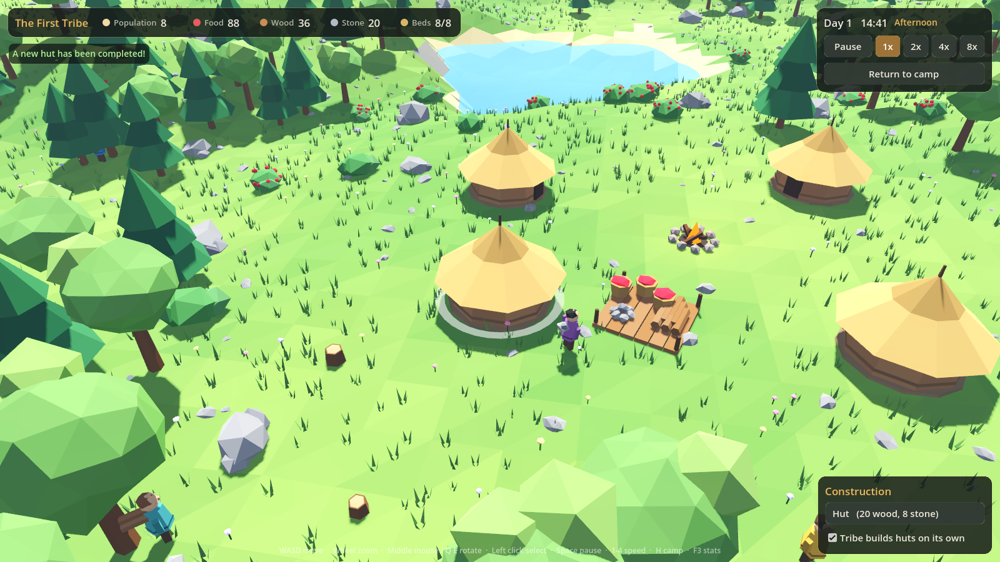
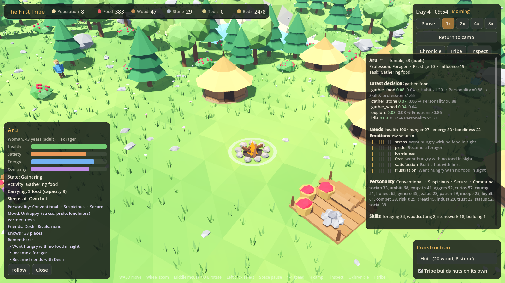

# Tribal — 3D Emergent Civilization Simulator

A god-game sandbox in Godot 4: one tribe, one living valley. You don't command
villagers; you shape the world and watch them survive, gather and build on
their own.



## Running

1. Install **Godot 4.3+** (standard build, no .NET needed).
2. Open the Godot project manager → **Import** → select this folder's `project.godot`.
3. Press **F5** (main scene: `scenes/main.tscn`).

From the command line: `godot --path .`

A new random valley is generated each run. Set `world_seed` in
`config/default_config.tres` to replay a specific world (the seed is printed on start).

## Controls

| Input | Action |
|---|---|
| WASD / arrow keys | Move camera |
| Mouse wheel | Zoom |
| Middle mouse drag, Q / E | Rotate camera |
| Left click | Select villager / resource / building |
| Right click, Esc | Deselect / cancel placement |
| Space or P | Pause / resume |
| 1 – 4 | Speed 1x / 2x / 4x / 8x |
| H | Return camera to the camp |
| B | Place a hut (Shift + click to place several) |
| F | Follow the selected villager |
| I | Detailed inspector for the selected villager (decision trace, emotions, family, relationships) |
| C | Chronicle: the tribe's history |
| T | Tribe panel: government, culture, groups, professions, knowledge, economy |
| F5 / F9 | Quick save / quick load (`user://tribal_save.dat`) |
| F3 | Performance overlay |

## What's in this milestone

- **World:** procedural low-poly terrain (heightfield mesh plus trimesh collision), hills,
  a lake, a flat settlement plateau, a mountain ring as the boundary, forests, rocks, berry
  bushes, and MultiMesh grass, flowers, pebbles and mountain pines.
- **One tribe, 8 villagers.** Each has an id, name, age, health, hunger, energy, an inventory
  (8 units), a current state and task, a 3D model, a collision shape and grid navigation.
- **Autonomous AI:** utility scoring picks a task: eat, rest, build, gather food, wood or stone,
  deliver, or idle. Each task is its own small state machine. Shown states are Idle, Searching
  for food, Eating, Moving to resource, Gathering, Returning, Delivering, Resting and Building.
- **Resources:** food, wood and stone come only from the world. Nodes deplete; trees regrow
  from stumps and bushes regrow berries; mined-out rocks disappear. Everything goes into
  a shared stockpile.
- **Settlement:** campfire, stockpile (piles grow visibly), 2 starting huts. The tribe plans
  new huts when beds run short, and you can place huts yourself. Villagers haul materials
  from the stockpile to the site, then build. Huts give 2 beds and double rest recovery.
- **Survival:** hunger rises, energy drains with activity and recovers in sleep (faster in a
  hut), health drops from starvation or exhaustion, and villagers can die (a grave is left).
- **Day/night:** a moving sun, a moon, a sky gradient, a campfire that glows brighter at night,
  and villagers sleep at night. Day length is configurable and follows pause and speed.
- **UI:** resource, population and bed counters; clock and phase; pause and speed buttons;
  return-to-camp; a selection panel with bars and Follow / Cancel-construction buttons; a
  construction panel with an auto-build toggle; notifications; a performance overlay.

## Architecture

```
scripts/
  autoload/   event_bus.gd     decoupled signals (UI, notifications, future memory system)
              sim_clock.gd     sim time, pause/speed, fixed sim_tick, time of day
  config/     game_config.gd   every tunable parameter (Resource -> config/default_config.tres)
  core/       main.gd          bootstrap order; world_context.gd shared refs; input_setup.gd;
              save_system.gd   full save/load
  world/      terrain.gd, nav_grid.gd (AStarGrid2D + obstacles + regions), world_generator.gd,
              resource_node.gd, resource_registry.gd, resource_type.gd, day_night_cycle.gd
  villager/   villager.gd (composition root) + villager_needs / _inventory / _movement /
              _brain / _state / _knowledge, decision_modifier.gd, habit_modifier.gd
              tasks/  villager_task.gd base + gather, eat, rest, build, deliver, idle,
                      socialize, converse, explore, help, ask_food, farm, fish,
                      craft, heal, ceremony, talk_to, work_site
  tribe/      tribe.gd (villagers, demand, housing), settlement_planner.gd, stockpile.gd
  social/     social_system.gd, personality.gd, emotions.gd, villager_memory.gd,
              memory_record.gd, memory_policy.gd, relationship_graph.gd, knowledge_store.gd,
              conversation_system.gd, conversation_outcome.gd, dialogue_renderer.gd,
              romance_system.gd, promise_book.gd, personality/social/emotion_modifier.gd
  society/    society_system.gd (owner) + demographics, tech, skills, professions, economy,
              proposals, politics, groups, culture, history_log
  buildings/  building_def.gd (data), building_catalog.gd, building.gd
  camera/     rts_camera.gd
  interaction/world_interaction.gd  raycast selection + placement ghost
  ui/         hud.gd, society_panels.gd (inspector/chronicle/tribe), relationship_overlay.gd
  visuals/    mesh_factory.gd  procedural low-poly meshes, shared material, caching
```

Key design points:

- **Simulation vs presentation.** Decisions and needs run on `SimClock.sim_tick` (4 Hz by
  default). Only movement interpolation and animation run per frame. Pause and speed work
  everywhere because nothing reads the raw frame delta for simulation.
- **Villager composition.** Needs, inventory, movement and the brain are separate objects;
  the current activity is a `VillagerTask`. New behaviour means adding a task and a goal.
- **Personality hook.** `VillagerBrain` scores goals, then passes the scores through every
  `DecisionModifier` attached to the villager. `HabitModifier` is the first real one. Traits,
  memories, relationships and mood can plug in here without touching the brain or tasks.
- **Memory hook.** Meaningful actions go through `Villager.record_event()`, which emits
  `EventBus.villager_event` with plain, serializable data (stable ids, time, day,
  position — never node references). Deaths, buildings etc. have their own signals.
- **Knowledge hook.** All "where is food/wood/stone" lookups go through
  `VillagerKnowledge`, so omniscient queries can later become learned knowledge.
- **Stable ids.** Villagers have `villager_id`; buildings and resource nodes get an
  `entity_id` from `WorldContext.allocate_entity_id()` for memories and save files.
- **Population hook.** `Tribe.add_villager()` is the single entry point for new members,
  so births and families can go through it later.
- **No tight coupling.** Villagers never touch the UI. Resource nodes don't know villagers
  exist (the registry handles queries and reservations). The UI only reads state and
  listens to signals.
- **Robust AI.** Targets are filtered by navigation region, so the AI never picks unreachable
  nodes. Unreachable targets go on a short blacklist (an early "memory"). Reservations stop
  pile-ups. Stuck detection triggers a repath, then fails the task cleanly. Tasks are only
  interrupted for urgent needs. A per-tick decision budget spreads pathfinding bursts.
- **Performance.** Shared meshes and a single vertex-colour material, MultiMesh for
  decoration, an integer flood fill for connectivity, bounded path smoothing, spatial-hash
  crowd separation. Counts and limits are in `GameConfig` (Performance group).

## Social simulation and civilization

There is one tribe. Inside it, people with their own personalities, emotions,
memories, skills and ambitions form friendships, rivalries, couples,
households, families, work crews, guilds and factions. Nothing is scripted:

- **People:** 19 personality traits, which children inherit from their
  parents. 18 emotions, each with a cause, intensity and decay. Memories fade
  and are reinterpreted. Five-dimensional, non-reciprocal relationships
  (affection, trust, respect, attraction, resentment) plus familiarity.
- **Conversations:** around 25 intents with real consequences, such as
  promises, teaching, gossip, accusations, fights, mediation, flirting,
  proposals and debates over community projects. Any outcome is validated
  against the world before it is applied.
- **Romance and family:** attraction, then flirting, then courting, then a
  proposal the other person can refuse. Couples share a home, can become
  lifelong partners, get jealous and break up.
- **Life cycle:** pregnancy and birth (biological sex, inherited traits and
  aptitudes), childhood, youth, adulthood and old age, then natural death.
  A year is 2 days, so generations turn over within a single session.
- **Work and knowledge:** nine skills improve through practice, observation
  and teaching, and decay with disuse. Five discoveries can spread through
  the tribe or be lost. Professions emerge from what people actually do, and
  guilds form once the tribe is big enough. Farms, workshops (tools), a
  longhouse and a shrine are built.
- **Society:** villagers propose community projects, which others support or
  oppose for their own reasons, and which can fail. Leadership emerges and
  changes, informally, through a chief, a hereditary line or a council. Disputes
  lead to mediation. Culture norms and traditions drift and shape behaviour.
  Tools can be held in common or privately. Everything is recorded in a
  chronicle.

Select a villager and press **I** to see why they did what they did.


Details, test mapping and limitations: [docs/SOCIAL_SIMULATION.md](docs/SOCIAL_SIMULATION.md).

## Tests

A headless test drives the real game at 8x speed and checks the acceptance criteria:
camera, raycast selection, every HUD button, real input events, construction and cancel,
gathering of all three resources, eating, resting, building, survival, counters and
day/night.

```bash
godot --headless --path . res://tests/sim_test.tscn --fixed-fps 60 -- --seed=1234 --days=4
godot --headless --path . res://tests/sim_test.tscn --fixed-fps 60 -- --seed=5 --days=3 --starve           # deaths
godot --headless --path . res://tests/sim_test.tscn --fixed-fps 60 -- --seed=11 --days=6 --scarce           # food crisis
godot --headless --path . res://tests/sim_test.tscn --fixed-fps 60 -- --days=1.5 --extra-villagers=200     # perf
godot --headless --path . res://tests/sim_test.tscn --fixed-fps 23 -- --seed=1234 --hash-at-tick=2400      # determinism: same hash at any fps
godot --headless --path . res://tests/sim_test.tscn --fixed-fps 60 -- --days=4 --social-seed=7 --layout    # village layout per social seed
```

The society test runs the tribe on its own for N days, then checks what
emerged and exercises each mechanism directly (requirements 1–17). It can also
save and reload a game and verify the result:

```bash
godot --headless --path . res://tests/society_test.tscn --fixed-fps 60 -- --seed=42 --days=30 [--chronicle]
godot --headless --path . res://tests/society_test.tscn --fixed-fps 60 -- --seed=42 --days=12 --save=/tmp/t.dat
godot --headless --path . res://tests/society_test.tscn --fixed-fps 60 -- --seed=42 --load=/tmp/t.dat
godot --headless --path . res://tests/sim_test.tscn --fixed-fps 60 -- --seed=42 --days=60 --history=400   # long run + chronicle
```

Screenshots (needs a display or `xvfb-run`):
`godot --path . res://tests/screenshot.tscn -- --out=/tmp/shots`
